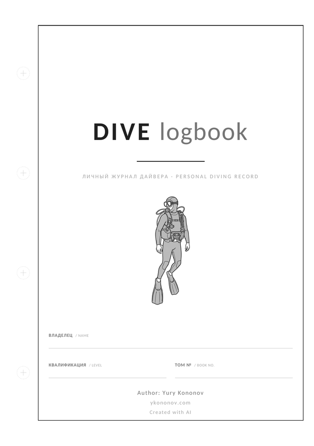
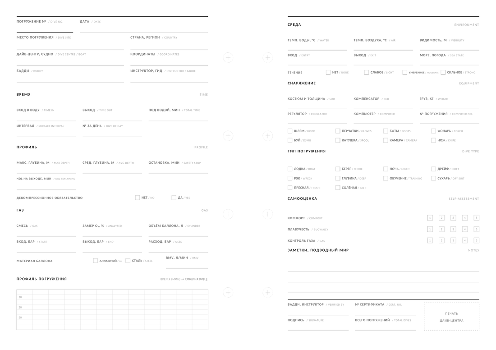
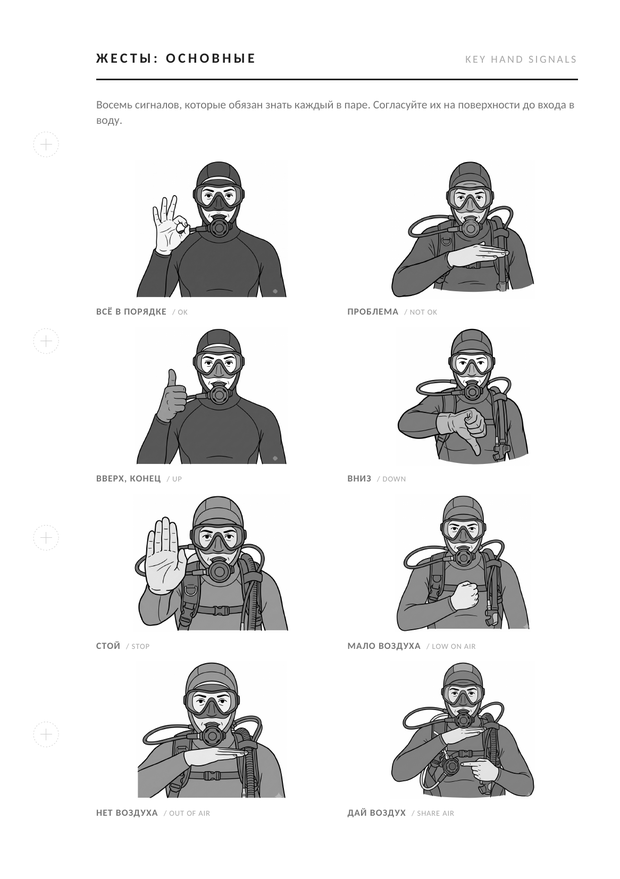
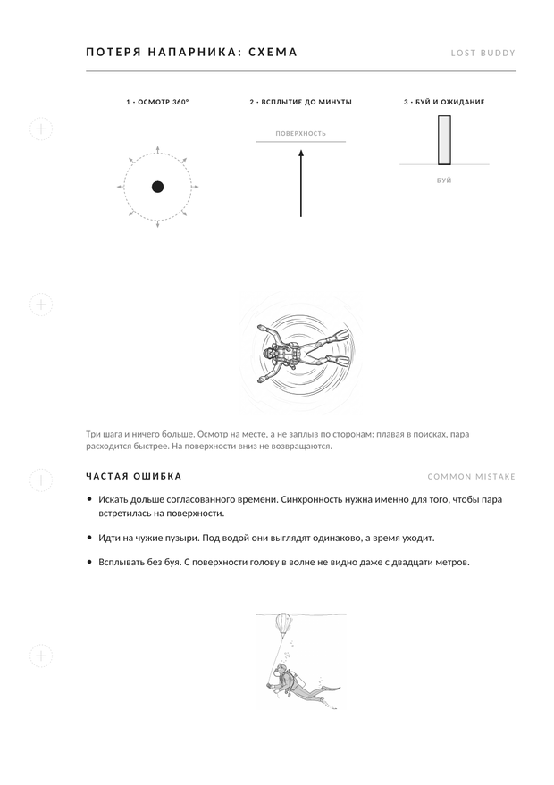

<div align="center">



# DIVE logbook — журнал погружений A5 для печати

**Печатный дайв-лог, справочник и памятка в одном.** 130 страниц, 42 разворота
под записи, подписи полей на русском и английском. Вёрстка описана кодом на
Python — книга собирается одной командой и правится текстом, а не в макете.

[**Скачать готовый PDF**](https://github.com/yknnv/dive-logbook/releases/latest) ·
[English](README.en.md) ·
[Как печатать](#печать) ·
[Доработка через ИИ](#доработка-через-ии)

[](https://github.com/yknnv/dive-logbook/actions/workflows/build.yml)
[](https://github.com/yknnv/dive-logbook/releases/latest)
[](LICENSE)
[](LICENSE-CONTENT)

</div>

---

## Что это

Личный журнал погружений, который печатается на обычном принтере или в
типографии и заполняется ручкой. Не приложение и не таблица: бумага не
разряжается, не требует связи и подписывается инструктором на месте.

- **130 страниц**, из них **42 разворота** под записи погружений
- **A5, 148 × 210 мм**, перфорация под кольцевой переплёт
- печать **в одну краску**, чёрным — дёшево в любой типографии
- подписи полей **на русском и английском**, для подписи у иностранного инструктора
- **справочный раздел**: безопасность и плановые величины, BWRAF, всплытие,
  потеря напарника, буй, жесты, действия при ЧП, декомпрессионная травма,
  экстренные контакты, давление и глубина, планирование газа, RMV в литрах,
  аварийный резерв, нитрокс и MOD, кислородная экспозиция, лимиты и перелёты,
  развесовка, базовые параметры

Парный проект для другой дисциплины — `sail-logbook`.

## Как выглядит

| Разворот записи | Жесты | Потеря напарника |
|---|---|---|
|  |  |  |

---

## Скачать и напечатать

Готовые PDF — на [странице релиза](https://github.com/yknnv/dive-logbook/releases/latest).
Собирать ничего не нужно. В репозиторий они не коммитятся: каждая
пересборка добавляла бы к истории 12 МБ бинарника.

| файл | зачем |
|---|---|
| `dive-logbook-A5-final.pdf` | основной, лист ровно 148 × 210 мм |
| `dive-logbook-A5-final-bleed3mm-cropmarks.pdf` | 154 × 216 мм с припуском 3 мм и метками реза, если типография режет пачкой |
| `punch-template-A5.pdf` | один лист 1:1 для проверки перфорации |

**Начните с шаблона перфорации.** Распечатайте его в масштабе 100 %, без
«вписать в страницу», и приложите к своей обложке: расположение колец
различается. Параметры правятся в начале `src/logbook.py`.

---

## Собрать самому

```bash
git clone https://github.com/yknnv/dive-logbook.git
cd dive-logbook
pip install -r requirements.txt
./build.sh
```

Нужен Python 3.10+. Результат появится в `dist/` — папка в `.gitignore`.
Сборка сама прогоняет проверку макета: выход за поля, горизонтальные
и вертикальные наложения.

### Настройки без правки вёрстки

В начале `src/logbook.py`:

```python
VERSION = "1.0"               # попадает в имя файла и свойства PDF
N_DIVES = 42                  # число разворотов под записи
N_NOTES = 10                  # страниц заметок в конце
KEEP_CREATED_WITH_AI = True   # строка на титуле
HOLE_D = 6 * mm               # диаметр отверстия
HOLE_INSET = 11 * mm          # от края листа до центра отверстия
HOLE_SPACING = 47 * mm        # между центрами соседних отверстий
HOLE_MARKS = True             # печатать метки под пробойник
M_BIND = 23 * mm              # поле со стороны колец
```

---

## Структура

```
src/logbook.py        геометрия, примитивы, обложка, карточки записей, сборка
src/reference.py      справочный раздел, одна функция на страницу
src/figures.py        векторные схемы
src/check_margins.py  проверка полей и наложений
assets/fonts/         Carlito, SIL OFL 1.1
assets/images/        иллюстрации, монохромные PNG
dist/                 результат сборки, не коммитится
docs/                 шаблон задания на иллюстрации, превью страниц
tools/                подготовка новых иллюстраций
CLAUDE.md             инструкции для ИИ-агента при доработке
```

---

## Правила вёрстки

Их стоит держать при любой доработке — подробности в
[CLAUDE.md](CLAUDE.md) и [CONTRIBUTING.md](CONTRIBUTING.md).

**Отступы задаются константами.** В `src/reference.py` объявлены `GAP_TEXT`,
`GAP_LIST`, `GAP_TABLE`, `GAP_FIG`, `GAP_NOTE`. Один тип элемента — один
отступ. Не помещается — режется содержимое, а не интервал: именно подгонка
интервалов под конкретную страницу и разводит книгу вразнос.

**Переполнение ловит сборка.** Каждая страница заканчивается `assert y >= MB`.
Если не влезло, сборка падает и называет страницу и недостающие миллиметры.
Правильная реакция: сократить текст, уменьшить картинку или разделить
страницу надвое.

**Подписи двуязычные.** `field(c, x, y, w, "русский", "english")` рисует
русское название плотно чёрным, английское светлее и мельче, с автоподбором
кегля под ширину колонки.

**Монохром.** Вся палитра — оттенки чёрного.

**Номеров страниц нет** намеренно: листы съёмные, порядок задаёт владелец.

---

## Проверка перед печатью

```bash
python3 src/check_margins.py dist/dive-logbook-A5-final.pdf
```

Три проверки: выход за границы набора с допуском 0,15 мм, горизонтальные
наложения символов, вертикальные наложения слов. Метки перфорации в поле
переплёта учитываются отдельно и нарушением не считаются. Та же проверка
идёт в CI на каждый пуш.

---

## Печать

- бумага 100–120 г/м², офсет
- поле со стороны колец 23 мм, внешнее 10 мм, чередуются по чётности
- печать двусторонняя, число страниц чётное
- карточка записи занимает разворот и всегда начинается с чётной страницы
- в типографию отдавайте вариант с припуском и метками реза, на домашний
  принтер — основной

---

## Доработка через ИИ

В корне лежит [CLAUDE.md](CLAUDE.md) — инструкции для агента: инварианты
вёрстки, карта файлов, шаблоны добавления страниц и схем, формат постановки
правки и список типовых граблей. Claude Code читает его автоматически при
открытии проекта; другим инструментам его можно просто передать в контекст.

---

## Лицензии и оговорки

Код — MIT. Содержимое книги (текст справочника, схемы, иллюстрации, готовые
PDF) — CC BY-NC-SA 4.0: печатайте для себя, для клуба и для группы, меняйте и
раздавайте, но не продавайте. Разбор по файлам — в [NOTICE](NOTICE).

Шрифт Carlito — SIL Open Font License 1.1, текст лицензии в
`assets/fonts/Carlito-COPYRIGHT.txt`. Метрически совместим с Calibri,
кириллица полная.

Иллюстрации сгенерированы ИИ и обработаны вручную. Схемы в `figures.py`
нарисованы кодом.

**Справочный раздел не заменяет обучение.** Числовые ориентиры зависят от
подготовки, снаряжения, местных правил и плана; там, где это существенно, в
тексте есть оговорка.
